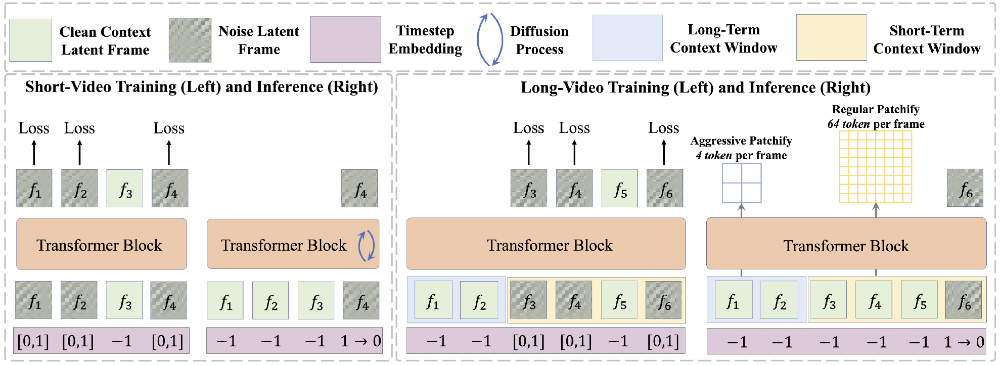
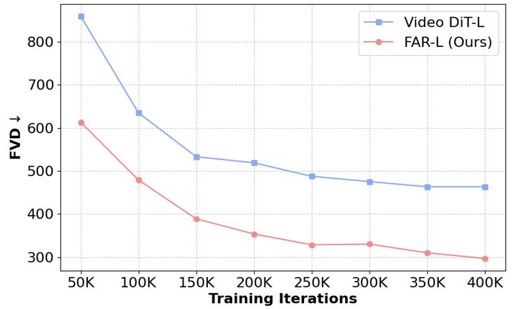
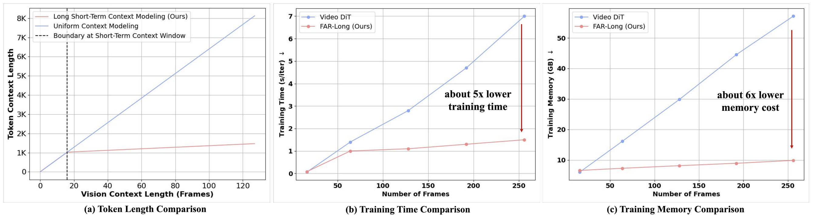
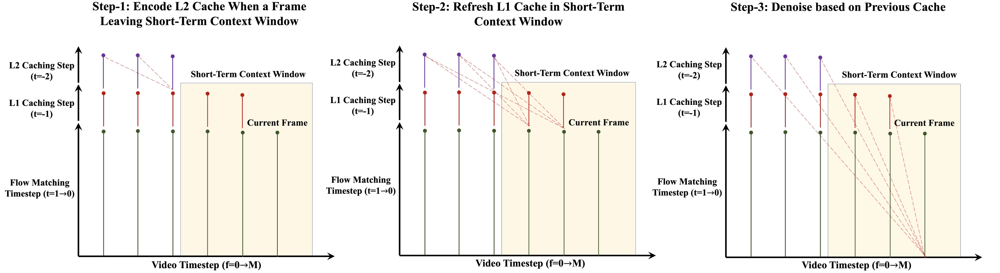
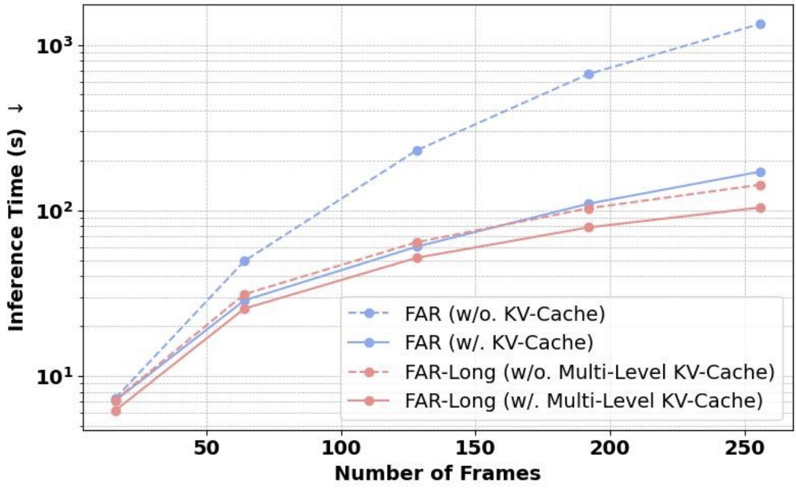

# 🎥 FAR: Frame Autoregressive Model for Both Short- and Long-Context Video Modeling 🚀

<div align="center">

[](https://farlongctx.github.io/)
[](https://arxiv.org/abs/2503.19325)&nbsp;
[](https://huggingface.co/guyuchao/FAR_Models)&nbsp;
[![SOTA](https://img.shields.io/badge/State%20of%20the%20Art-Video%20Generation%20-32B1B4?logo=data%3Aimage%2Fsvg%2Bxml%3Bbase64%2CPHN2ZyB3aWR0aD0iNjA2IiBoZWlnaHQ9IjYwNiIgeG1sbnM9Imh0dHA6Ly93d3cudzMub3JnLzIwMDAvc3ZnIiB4bWxuczp4bGluaz0iaHR0cDovL3d3dy53My5vcmcvMTk5OS94bGluayIgb3ZlcmZsb3c9ImhpZGRlbiI%2BPGRlZnM%2BPGNsaXBQYXRoIGlkPSJjbGlwMCI%2BPHJlY3QgeD0iLTEiIHk9Ii0xIiB3aWR0aD0iNjA2IiBoZWlnaHQ9IjYwNiIvPjwvY2xpcFBhdGg%2BPC9kZWZzPjxnIGNsaXAtcGF0aD0idXJsKCNjbGlwMCkiIHRyYW5zZm9ybT0idHJhbnNsYXRlKDEgMSkiPjxyZWN0IHg9IjUyOSIgeT0iNjYiIHdpZHRoPSI1NiIgaGVpZ2h0PSI0NzMiIGZpbGw9IiM0NEYyRjYiLz48cmVjdCB4PSIxOSIgeT0iNjYiIHdpZHRoPSI1NyIgaGVpZ2h0PSI0NzMiIGZpbGw9IiM0NEYyRjYiLz48cmVjdCB4PSIyNzQiIHk9IjE1MSIgd2lkdGg9IjU3IiBoZWlnaHQ9IjMwMiIgZmlsbD0iIzQ0RjJGNiIvPjxyZWN0IHg9IjEwNCIgeT0iMTUxIiB3aWR0aD0iNTciIGhlaWdodD0iMzAyIiBmaWxsPSIjNDRGMkY2Ii8%2BPHJlY3QgeD0iNDQ0IiB5PSIxNTEiIHdpZHRoPSI1NyIgaGVpZ2h0PSIzMDIiIGZpbGw9IiM0NEYyRjYiLz48cmVjdCB4PSIzNTkiIHk9IjE3MCIgd2lkdGg9IjU2IiBoZWlnaHQ9IjI2NCIgZmlsbD0iIzQ0RjJGNiIvPjxyZWN0IHg9IjE4OCIgeT0iMTcwIiB3aWR0aD0iNTciIGhlaWdodD0iMjY0IiBmaWxsPSIjNDRGMkY2Ii8%2BPHJlY3QgeD0iNzYiIHk9IjY2IiB3aWR0aD0iNDciIGhlaWdodD0iNTciIGZpbGw9IiM0NEYyRjYiLz48cmVjdCB4PSI0ODIiIHk9IjY2IiB3aWR0aD0iNDciIGhlaWdodD0iNTciIGZpbGw9IiM0NEYyRjYiLz48cmVjdCB4PSI3NiIgeT0iNDgyIiB3aWR0aD0iNDciIGhlaWdodD0iNTciIGZpbGw9IiM0NEYyRjYiLz48cmVjdCB4PSI0ODIiIHk9IjQ4MiIgd2lkdGg9IjQ3IiBoZWlnaHQ9IjU3IiBmaWxsPSIjNDRGMkY2Ii8%2BPC9nPjwvc3ZnPg%3D%3D)](https://paperswithcode.com/sota/video-generation-on-ucf-101)
<a href="https://colab.research.google.com/drive/1XK4shPcZgJBUdJC3skNz9iq1Dc1UNj0n?usp=drive_link"></a>

</div>


<p align="center" style="font-size: larger;">
  <a href="https://arxiv.org/abs/2503.19325">Long-Context Autoregressive Video Modeling with Next-Frame Prediction</a>
</p>


## 📢 News

* **2025-04:** Update multi-level KV cache for faster inference on long video. 🎉 Check our [updated paper](https://arxiv.org/abs/2503.19325) for details. We release colab demo for inference speed test. <a href="https://colab.research.google.com/drive/1XK4shPcZgJBUdJC3skNz9iq1Dc1UNj0n?usp=drive_link"></a>
* **2025-04:** Release colab demo for quick inference! 🎉 <a href="https://colab.research.google.com/drive/1XK4shPcZgJBUdJC3skNz9iq1Dc1UNj0n?usp=drive_link"></a>
* **2025-03:** Paper and code of [FAR](https://farlongctx.github.io/) are released! 🎉


## 🌟 What's the Potential of FAR?

### 🔥 Introducing FAR: a new baseline for autoregressive video generation

FAR (i.e., <u>**F**</u>rame <u>**A**</u>uto<u>**R**</u>egressive Model) learns to predict continuous frames based on an autoregressive context. Its objective aligns well with video modeling, similar to the next-token prediction in language modeling.



### 🔥 FAR achieves better convergence than video diffusion models with the same continuous latent space

<p align="center">

<p>

### 🔥 FAR leverages clean visual context without additional image-to-video fine-tuning:

Unconditional pretraining on UCF-101 achieves state-of-the-art results in both video generation (context frame = 0) and video prediction (context frame ≥ 1) within a single model.

<p align="center">

<p>

### 🔥 FAR supports efficient training on long video sequences with manageable token lengths:

The key technique behind this is **long short-term context modeling**, where we use regular patchification for short-term context to ensure fine-grained temporal consistency and **aggressive patchification** for long-term context to reduce redundant tokens.

<p align="center">

<p>

### 🔥 FAR exploits the multi-level KV-Cache to speed up autoregressive inference on long videos:

<p align="center">

<p>

#### 📚 For more details, check out our [paper](https://arxiv.org/abs/2503.19325).


## 🏋️‍♂️ FAR Model Zoo
We provide trained FAR models in our paper for re-implementation.

### Video Generation

We use seed-[0,2,4,6] in evaluation, following the evaluation prototype of [Latte](https://arxiv.org/abs/2401.03048):

| Model (Config) | #Params | Resolution | Condition | FVD | HF Weights | Pre-Computed Samples | Train Cost (H100 Days) |
|:-------:|:------------:|:------------:|:-----------:|:-----:|:----------:|:----------:|:----------:|
| [FAR-L](options/train/far/video_generation/FAR_L_ucf101_uncond_res128_400K_bs32.yml) | 457 M | 128x128 | ✗ | 280 ± 11.7 | [Model-HF](https://huggingface.co/guyuchao/FAR_Models/resolve/main/video_generation/FAR_L_UCF101_Uncond128-c19abd2c.pth) |  [Google Drive](https://drive.google.com/drive/folders/1p1MvCiTfoUYAUYNqQNG6nEU02zy8U1vp?usp=drive_link) | 12.2 |
| [FAR-L](options/train/far/video_generation/FAR_L_ucf101_cond_res128_400K_bs32.yml) | 457 M | 128x128 | ✓ | 99 ± 5.9 | [Model-HF](https://huggingface.co/guyuchao/FAR_Models/resolve/main/video_generation/FAR_L_UCF101_Cond128-c6f798bf.pth) | [Google Drive](https://drive.google.com/drive/folders/1p1MvCiTfoUYAUYNqQNG6nEU02zy8U1vp?usp=drive_link) | 12.2 |
| [FAR-L](options/train/far/video_generation/FAR_L_ucf101_uncond_res256_400K_bs32.yml) | 457 M | 256x256 | ✗ | 303 ± 13.5 | [Model-HF](https://huggingface.co/guyuchao/FAR_Models/resolve/main/video_generation/FAR_L_UCF101_Uncond256-adea51e9.pth) | [Google Drive](https://drive.google.com/drive/folders/1p1MvCiTfoUYAUYNqQNG6nEU02zy8U1vp?usp=drive_link) | 12.7 |
| [FAR-L](options/train/far/video_generation/FAR_L_ucf101_cond_res256_400K_bs32.yml) | 457 M | 256x256 | ✓ | 113 ± 3.6 | [Model-HF](https://huggingface.co/guyuchao/FAR_Models/resolve/main/video_generation/FAR_L_UCF101_Cond256-41c6033f.pth) | [Google Drive](https://drive.google.com/drive/folders/1p1MvCiTfoUYAUYNqQNG6nEU02zy8U1vp?usp=drive_link) | 12.7 |
| [FAR-XL](options/train/far/video_generation/FAR_XL_ucf101_uncond_res256_400K_bs32.yml) | 657 M | 256x256 | ✗ | 279 ± 9.2 | [Model-HF](https://huggingface.co/guyuchao/FAR_Models/resolve/main/video_generation/FAR_XL_UCF101_Uncond256-3594ce6b.pth) | [Google Drive](https://drive.google.com/drive/folders/1p1MvCiTfoUYAUYNqQNG6nEU02zy8U1vp?usp=drive_link) | 14.6 |
| [FAR-XL](options/train/far/video_generation/FAR_XL_ucf101_cond_res256_400K_bs32.yml) | 657 M | 256x256 | ✓ | 108 ± 4.2 | [Model-HF](https://huggingface.co/guyuchao/FAR_Models/resolve/main/video_generation/FAR_XL_UCF101_Cond256-28a88f56.pth) | [Google Drive](https://drive.google.com/drive/folders/1p1MvCiTfoUYAUYNqQNG6nEU02zy8U1vp?usp=drive_link) | 14.6 |

###  Short-Video Prediction

We follows the evaluation prototype of [MCVD](https://arxiv.org/abs/2205.09853) and [ExtDM](https://openaccess.thecvf.com/content/CVPR2024/papers/Zhang_ExtDM_Distribution_Extrapolation_Diffusion_Model_for_Video_Prediction_CVPR_2024_paper.pdf):

| Model (Config) | #Params | Dataset | PSNR | SSIM | LPIPS | FVD | HF Weights | Pre-Computed Samples | Train Cost (H100 Days) |
|:-----:|:------------:|:------------:|:-----:|:-----:|:-----:|:-----:|:----------:|:----------:|:------:|
| [FAR-B](options/train/far/short_video_prediction/FAR_B_ucf101_res64_200K_bs32.yml) | 130 M | UCF101 | 25.64 | 0.818 | 0.037 | 194.1 | [Model-HF](https://huggingface.co/guyuchao/FAR_Models/resolve/main/short_video_prediction/FAR_B_UCF101_Uncond64-381d295f.pth) | [Google Drive](https://drive.google.com/drive/folders/1p1MvCiTfoUYAUYNqQNG6nEU02zy8U1vp?usp=drive_link) | 3.6 |
| [FAR-B](options/train/far/short_video_prediction/FAR_B_bair_res64_200K_bs32.yml) | 130 M | BAIR (c=2, p=28) | 19.40 | 0.819 | 0.049 | 144.3 | [Model-HF](https://huggingface.co/guyuchao/FAR_Models/resolve/main/short_video_prediction/FAR_B_BAIR_Uncond64-1983191b.pth) | [Google Drive](https://drive.google.com/drive/folders/1p1MvCiTfoUYAUYNqQNG6nEU02zy8U1vp?usp=drive_link) | 2.6 |

###  Long-Video Prediction

We use seed-[0,2,4,6] in evaluation, following the evaluation prototype of [TECO](https://arxiv.org/abs/2210.02396):


| Model (Config) | #Params | Dataset | PSNR | SSIM | LPIPS | FVD | HF Weights | Pre-Computed Samples |  Train Cost (H100 Days) |
|:-----:|:------------:|:------------:|:-----:|:-----:|:-----:|:-----:|:----------:|:----------:|:----------:|
| [FAR-B-Long](options/train/far/long_video_prediction/FAR_B_Long_dmlab_res64_400K_bs32.yml) | 150 M | DMLab | 22.3 | 0.687 | 0.104 | 64 | [Model-HF](https://huggingface.co/guyuchao/FAR_Models/resolve/main/long_video_prediction/FAR_B_Long_DMLab_Action64-c09441dc.pth) | [Google Drive](https://drive.google.com/drive/folders/1p1MvCiTfoUYAUYNqQNG6nEU02zy8U1vp?usp=drive_link) | 17.5 |
| [FAR-M-Long](options/train/far/long_video_prediction/FAR_M_Long_minecraft_res128_400K_bs32.yml) | 280 M | Minecraft | 16.9 | 0.448 | 0.251 | 39 | [Model-HF](https://huggingface.co/guyuchao/FAR_Models/resolve/main/long_video_prediction/FAR_M_Long_Minecraft_Action128-4c041561.pth) | [Google Drive](https://drive.google.com/drive/folders/1p1MvCiTfoUYAUYNqQNG6nEU02zy8U1vp?usp=drive_link) | 18.2 |

## 🔧 Dependencies and Installation

### 1. Setup Environment:

```bash
# Setup Conda Environment
conda create -n FAR python=3.10
conda activate FAR

# Install Pytorch
conda install pytorch==2.5.0 torchvision==0.20.0 torchaudio==2.5.0 pytorch-cuda=12.4 -c pytorch -c nvidia

# Install Other Dependences
pip install -r requirements.txt
```

### 2. Prepare Dataset:

We have uploaded the dataset used in this paper to Hugging Face datasets for faster download. Please follow the instructions below to prepare.

```python
from huggingface_hub import snapshot_download, hf_hub_download

dataset_url = {
    "ucf101": "guyuchao/UCF101",
    "bair": "guyuchao/BAIR",
    "minecraft": "guyuchao/Minecraft",
    "minecraft_latent": "guyuchao/Minecraft_Latent",
    "dmlab": "guyuchao/DMLab",
    "dmlab_latent": "guyuchao/DMLab_Latent"
}

for key, url in dataset_url.items():
    snapshot_download(
        repo_id=url,
        repo_type="dataset",
        local_dir=f"datasets/{key}",
        token="input your hf token here"
    )
```

Then, enter its directory and execute:

```bash
find . -name "shard-*.tar" -exec tar -xvf {} \;
```


### 3. Prepare Pretrained Models of FAR:

We have uploaded the pretrained models of FAR to Hugging Face models. Please follow the instructions below to download if you want to evaluate FAR.

```bash
from huggingface_hub import snapshot_download, hf_hub_download

snapshot_download(
    repo_id="guyuchao/FAR_Models",
    repo_type="model",
    local_dir="experiments/pretrained_models/FAR_Models",
    token="input your hf token here"
)
```

## 🚀 Training

To train different models, you can run the following command:

```bash
accelerate launch \
    --num_processes 8 \
    --num_machines 1 \
    --main_process_port 19040 \
    train.py \
    -opt train_config.yml
```

* **Wandb:** Set ```use_wandb``` to ```True``` in config to enable wandb monitor.
* **Periodally Evaluation:** Set ```val_freq``` to control the peroidly evaluation in training.
* **Auto Resume:** Directly rerun the script, the model will find the lastest checkpoint to resume, the wandb log will automatically resume.
* **Efficient Training on Pre-Extracted Latent:** Set ```use_latent``` to ```True```, and set the ```data_list``` to corresponding latent path list.

## 💻 Sampling & Evaluation

To evaluate the performance of a pretrained model, just copy the training config and set the ```pretrain_network: ~``` to your trained folder. Then run the following scripts:


```bash
accelerate launch \
    --num_processes 8 \
    --num_machines 1 \
    --main_process_port 10410 \
    test.py \
    -opt test_config.yml
```

## 📜 License
This project is licensed under the MIT License - see the [LICENSE](LICENSE) file for details.


## 📖 Citation
If our work assists your research, feel free to give us a star ⭐ or cite us using:
```
@article{gu2025long,
    title={Long-Context Autoregressive Video Modeling with Next-Frame Prediction},
    author={Gu, Yuchao and Mao, weijia and Shou, Mike Zheng},
    journal={arXiv preprint arXiv:2503.19325},
    year={2025}
}
```
